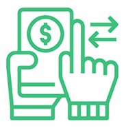
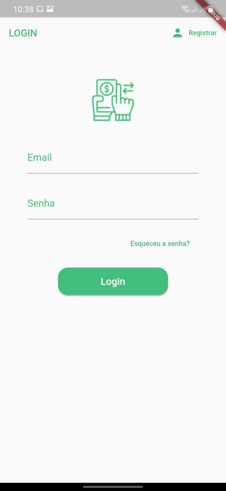
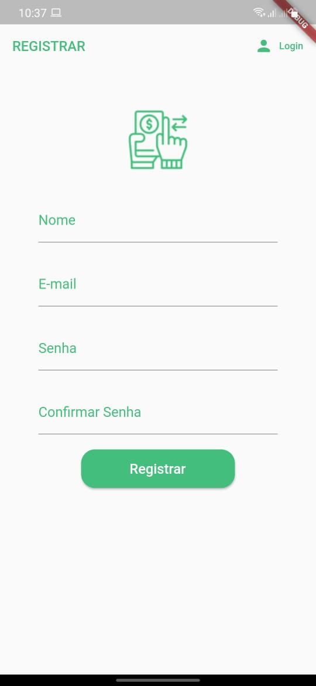
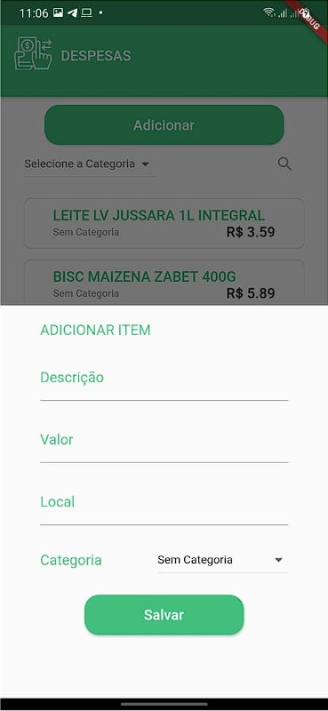
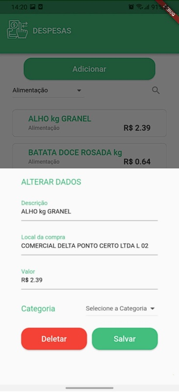
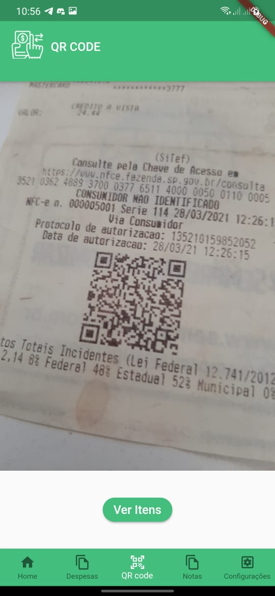
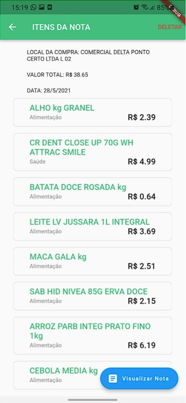
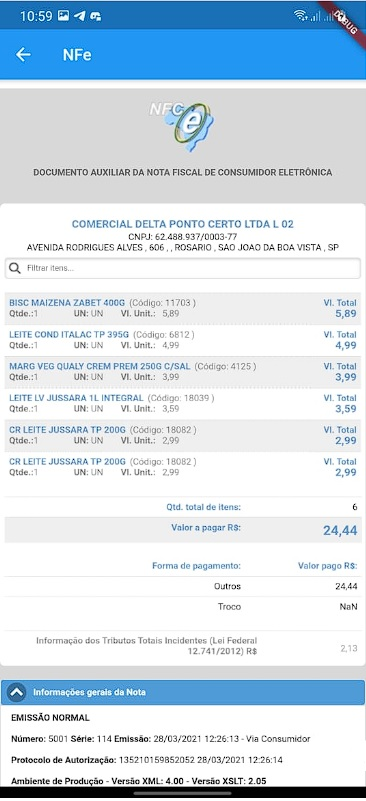
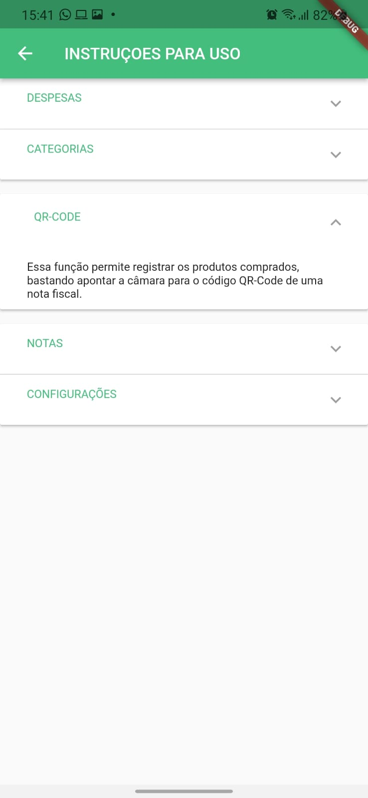

 
  

<h1 align="center">
    KnowBills: Know your expenses
</h1>

 
 
 
 

## Sobre o aplicativo

KnowBills - é um aplicativo para controle de despesas pessoais, que visa contribuir com a consciêntização e educação financeira, contendo como principal característica a funcionalidade de registrar os produtos comprados através da leitura do QR-CODE das notas fiscais, de forma a facilitar a entrada de dados e contribuir com o controle financeiro pessoal.

Os usuários encontrarão as seguintes funcionalidades:
- Criação e gerenciamento de conta;
- Inserção manual de despesas;
- Inserção de despesas pelo recurso de leitura de QR-CODE;
- Categorização de despesas;
- Gerenciamento de categorias;
- Geração de Relatórios.

## Layout

### Telas: Login e Cadastro

  
  

### Telas: Inicial e Despesas

  
  

### Telas: Adicionar e Alterar

  
  
  

### Telas: Leitura QR-CODE

  

### Telas: Item e consulta das notas

  
  
  

### Telas: Ajuda

  

## Propostas
- Atualmente o aplicativo oferece gerenciamento de categorias, no entanto ainda não permite o gerenciamento de forma individual e as operações são realizadas para todos os usuários. Além disso, o recurso de consulta de nota fiscal abrange, por enquanto, somente o estado de São Paulo. 
- Os dados obtidos com as consultas são suficientes para gerenciamento e categorização automática dos produtos. 
- Implementação de recursos para aprimorar a ergonomia do aplicativo em relação a intereção com o usuário.

## Tecnologias

As seguintes ferramentas foram usadas na construção do aplicativo:

- [Dart][dart]
- [Flutter][flutter]
- [Firebase][firebase]
- [Consulta NFCe - Secretaria da Fazenda][nfce]

[dart]: https://dart.dev/
[flutter]: https://flutter.dev/
[firebase]: https://firebase.google.com/
[nfce]: https://www.nfce.fazenda.sp.gov.br/NFCeConsultaPublica/Paginas/ConsultaPublica.aspx
